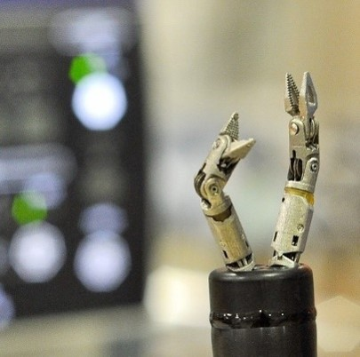
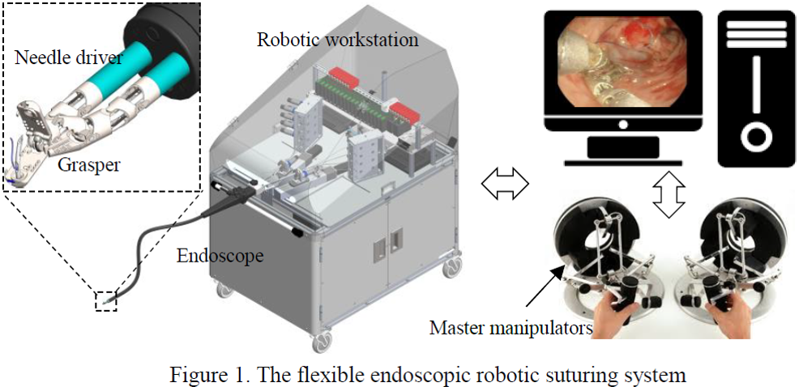
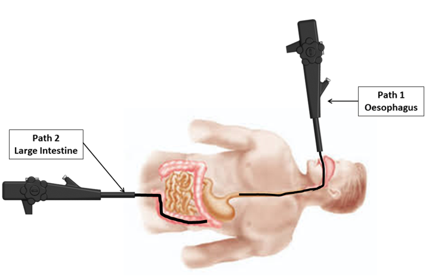
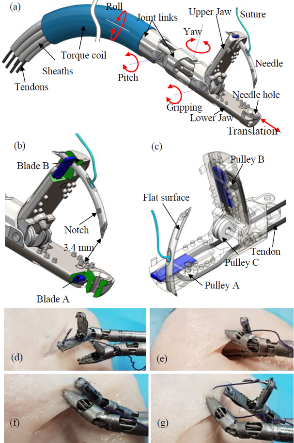
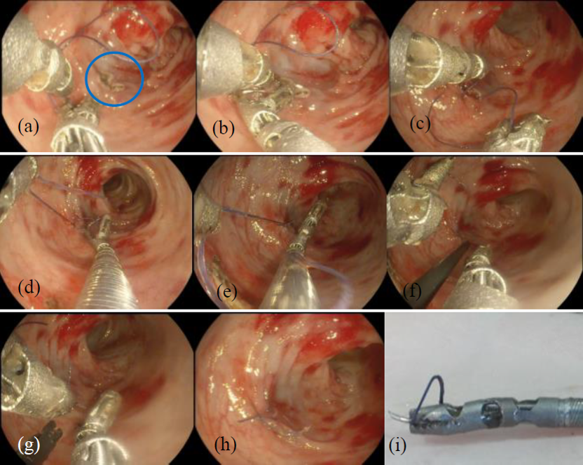
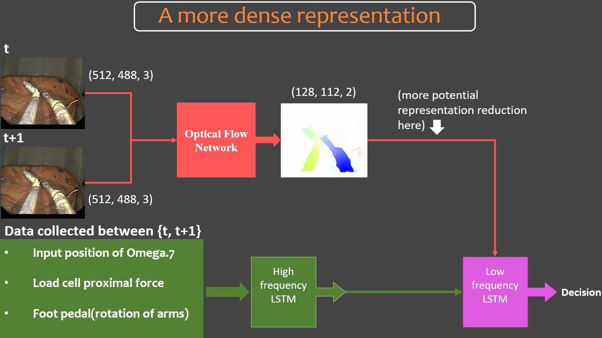
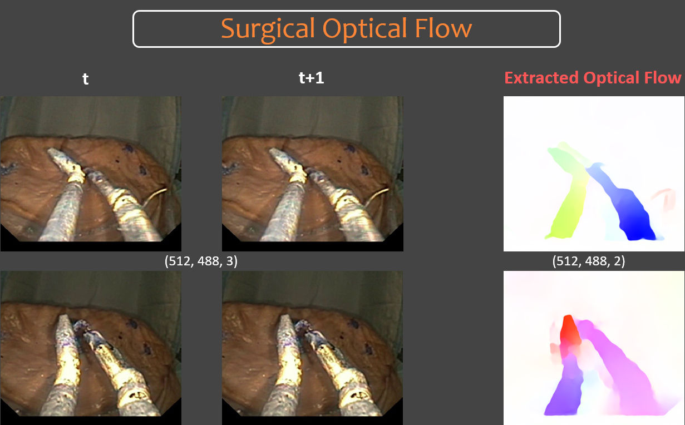
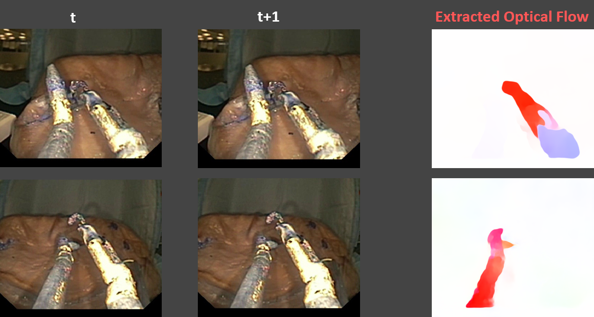

# Surgical robotic Visual Odometry with Optical Flow

## In this project, we will look into how AI helps to solve some of the toughest challenges facing surgical robotics

As of Aug 2020, this is still an on-going project. Therefore, below I will share with you some of the high-level overview and strategies we plan to take without sharing too much of the details that we have to reserve for a publication.

This Repo will be updated as the project progresses.

## The surgical robot

Here is an overview of our robotic system where the surgeon controls the robot via a **Master console**. The actually robot is primarily comprised of two parts: **Robotic workstation** that reside outside human body which includes all essential components such as actuators, force sensors, controllers, etc. On the other hand, **Endoscope** and **robotic tools**, which will be delivered into the human body to perform surgery at the desired surgical site.

Our robotics system enters human body in one of two ways, normally determined by shortest path to reach surgical site without incision.

## The Chanllenge

By design, this robotics system aims to perform surgery **without any incision** on the abdominal area. Hence, all instruments are extremely where the tool itself is only of a diameter of less than 4mm.

Anything in the world, with making it super small, there comes a price. For us, it’s that we can not mount any force sensor in front to measure the **distal-force of the robot**. This limitation leads to a few issues: 1. robot runs on open loop control—**control accuracy suffers**. 2. Surgeon operates without haptic feedback—**deteriorated surgical performance**.

## How do we help the issue with Deep Learning?

Well, we are going to build a hybrid architecture that leverages both **sensory data** from the robotic sensors and **visual data** from the endoscopic vision to learn to predict the force.

The overall strategy is delineated as follows:

More details explaining the architecture’s functions will be reveal later when the research is more mature and publication accomplished.

The general idea is that we use **Optical Flow Network** to extract **movement features** from the video and **LSTM** to process **high frequency sensory data**. Later, a **low frequency LSTM** is used as *Meta-learner*.

## Extracting Surgical Flow from Video

The interesting part comes from how do we efficiently extract movement information from the video.

There are a few factors that are important for this application:

* Identify where the **surgical tool** is
* Extract useful information such as **movement status/speed**
* Ignore useless info to preserve computation efficiency and not to confuse downstream LSTM
* Fast computation speed

Below are some sample result of the Surgical Flow:

